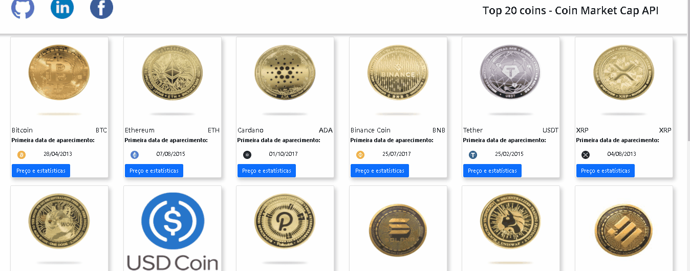
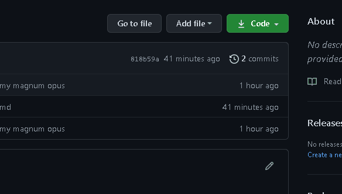

# Criptocoin API from Coin Market Cap

<center>



</center>

> **Status:** Em desenvolvimento

## Descrição:

* Uma interface simples criada com  [bootstrap](https://getbootstrap.com/docs/5.1/getting-started/introduction/) e com as infromações da [API do Coin Market Cap](https://coinmarketcap.com/api/);
* Ordenando por ranking as 20 criptomoedas de maior valor de acordo com a CMC;
* Cada uma com o seu próprio ícone, símbolo, nome e estatísticas, o redirecionando para o site com os valores de mercado da moeda corrente;

## Rodando em seu computador:

  1. Você pode fazer o dowload do repositório como demonstrado abaixo

<center>



</center>

**ou**

  1. Com o [Git](https://git-scm.com/) instalado, pode escrever o seguinte comando para clonar o repositório:
      - ```bash
        $git clone  https://github.com/Eric-Gabriel-Larroque/API_Criptomoeda_JS.git    
  
  2. Você precisará de uma chave de acesso para a API, para obtê-la basta criar uma conta no próprio site:
     - [Create CMC Account](https://coinmarketcap.com/api/)  
  
  3. Finalmente, para evitar problemas com as requisições API, você precisará instalar a seguinte extensão do ([Moesif](https://www.moesif.com/?int_source=corsextension)) Em seu computador (mantenha a extensão ligada enquanto roda o projeto):
       - [para Chrome](https://chrome.google.com/webstore/detail/moesif-origin-cors-change/digfbfaphojjndkpccljibejjbppifbc)
       - [Mozilla](https://addons.mozilla.org/pt-BR/firefox/addon/moesif-origin-cors-changer1/)
       - [Edge](https://microsoftedge.microsoft.com/addons/detail/cors-unblock/hkjklmhkbkdhlgnnfbbcihcajofmjgbh)
  
  4. Depois de ter criado sua conta e obtido a chave, a insira no campo comentado no arquivo .js (caso queira desenvolver a aplicação, exporte a chave de outro arquivo js ou json).

## Créditos:

- Ícones de mídia social feitos por:
  - <div><a href="https://www.freepik.com" title="Freepik">Freepik</a> do <a href="https://www.flaticon.com/br/" title="Flaticon">www.flaticon.com</a>;</div>
  - <div><a href="https://www.flaticon.com/br/autores/pixel-perfect" title="Pixel perfect">Pixel perfect</a> do <a href="https://www.flaticon.com/br/" title="Flaticon">www.flaticon.com</a>.</div>
